# Outfit AI

**An agentic AI wardrobe and styling platform — built to solve a real closet problem.**

Most people wear roughly 20% of their wardrobe on repeat, yet keep buying clothes that don't match what they already own. Outfit AI addresses this from three angles:

1. **Get more creative mileage from clothes you already have** — surface combinations you wouldn't think of on your own.
2. **Prevent bad purchases before they happen** — understand what's already in your wardrobe and what actually pairs with it.
3. **Smart outfit recommendations that factor in weather, occasion, and your own evolving taste** — not just "these colors look nice together."

---
## Download the Android App 

[Link to Download](https://expo.dev/accounts/shar_ayush/projects/outfitai-app/builds/655fc49f-3378-457c-9784-3484186090c3)

## App Screenshots

### 1. Home & Daily Weather-Aware Recommendations
| Daily Curated Recommendation | Scheduled Outfit & Quick Actions |
|:---:|:---:|
| 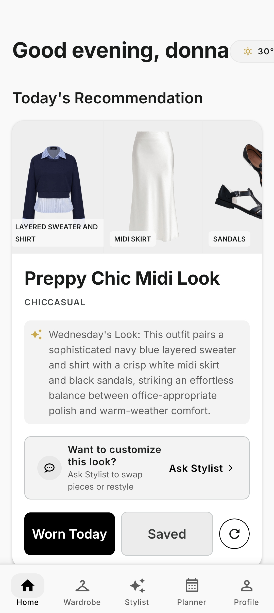 | 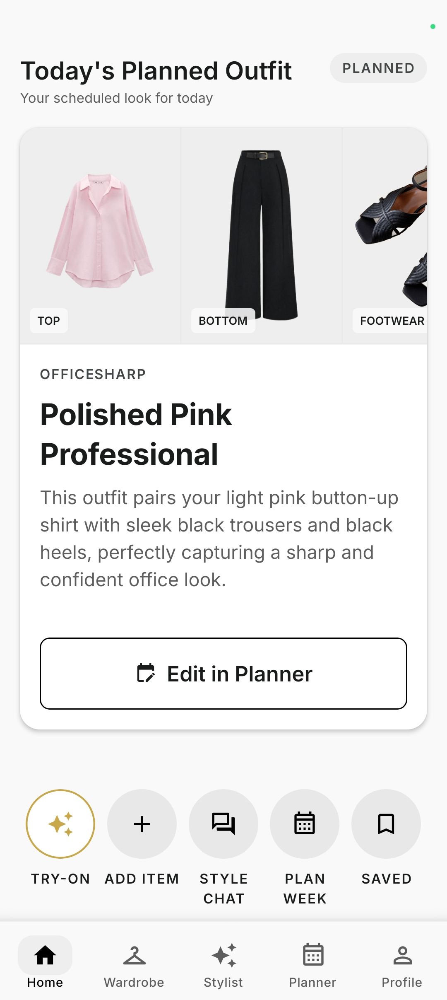 |
| *Weather-aware recommendation with real-time temperature, styling note & action triggers* | *Today's planned look with quick actions for Try-On, Style Chat, and Week Planning* |

### 2. AI Stylist Chat & Multi-Turn Refinements
| Conversational Stylist & Scores | Weather Adaptation (Rain) | Slot Swap (Pink Top) | Continual Refinement (Denim) |
|:---:|:---:|:---:|:---:|
| 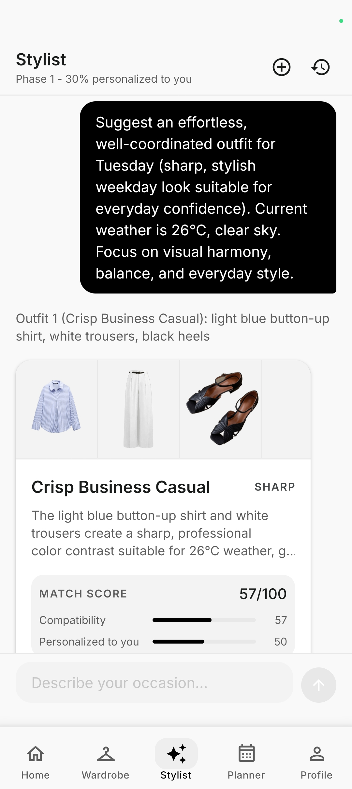 | 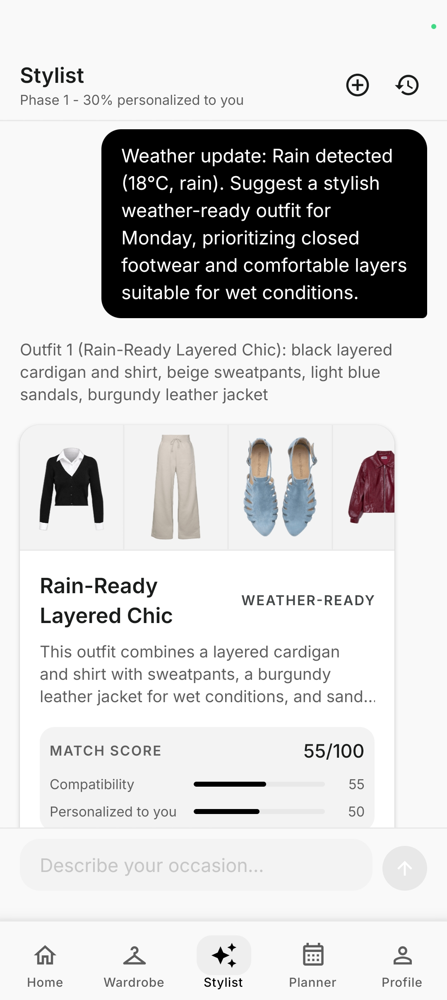 | 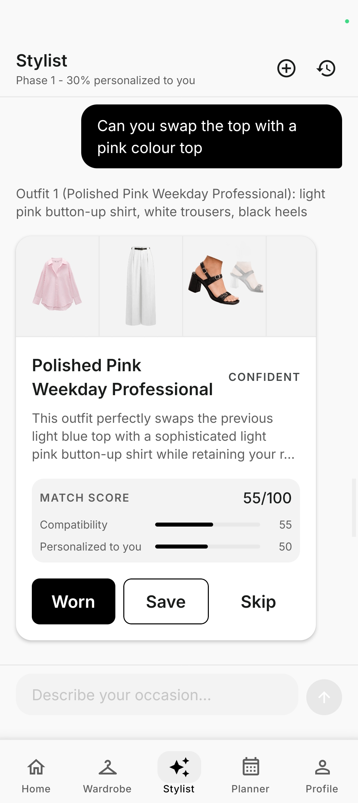 | 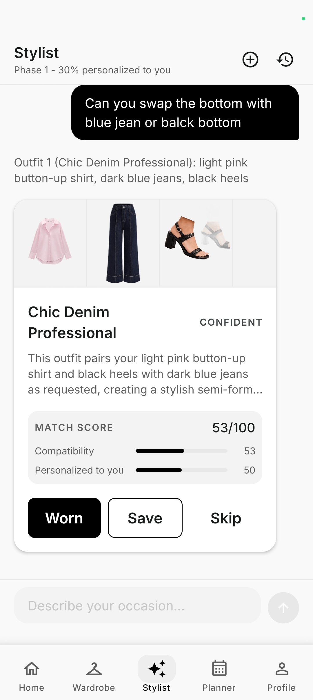 |
| *Real-time compatibility & personalization scoring breakdown* | *Automatic adaptation to rainy conditions and weather changes* | *Multi-turn intent merging & slot swap retaining other items* | *Conversational continuity across multiple styling turns* |

### 3. Digital Wardrobe & Inventory Management
| Tops & Wear Tracking | Bottoms & Formality Filter |
|:---:|:---:|
| 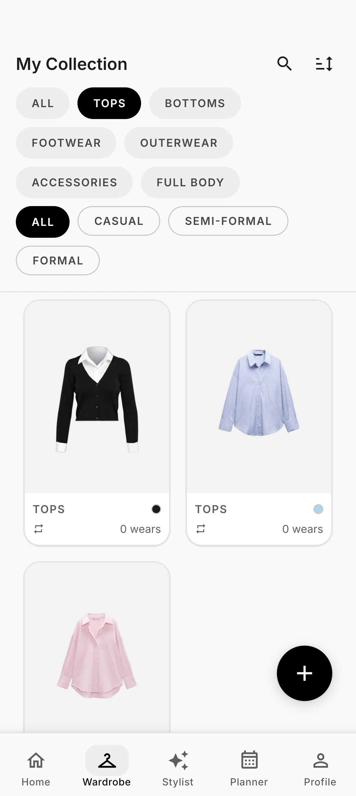 | 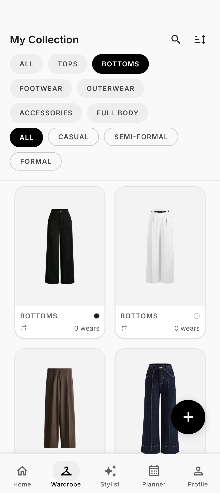 |
| *Categorized inventory with wear-frequency counters and color dots* | *Fast category and formality filtering (Casual, Semi-Formal, Formal)* |

### 4. Weekly Outfit Planner & Visual Designer
| 7-Day Weekly Calendar | Visual Outfit Composition Canvas |
|:---:|:---:|
| 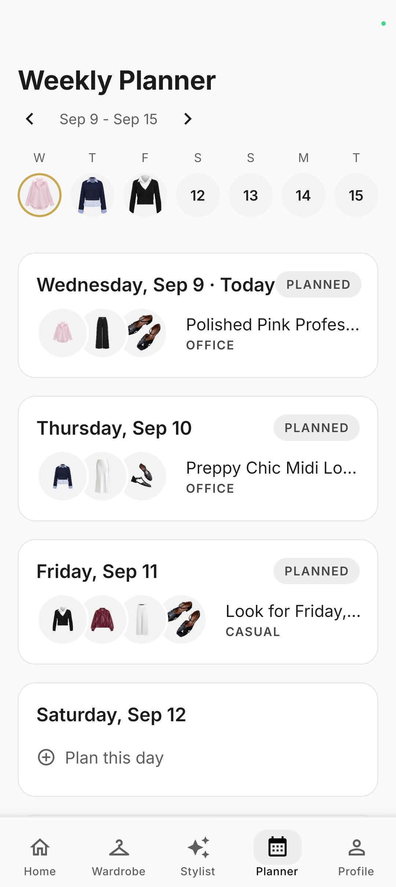 | 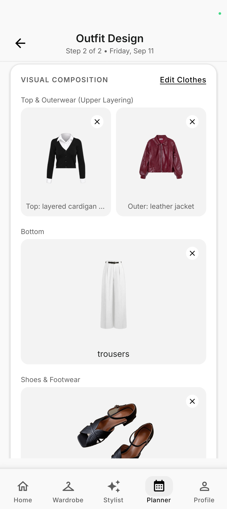 |
| *Calendar week overview with planned look previews and status chips* | *Layer-by-layer outfit visual designer (top, outer, bottom, shoes)* |

### 5. AI Virtual Try-On Studio
| Original Model Photo | Photorealistic AI Try-On Result |
|:---:|:---:|
| 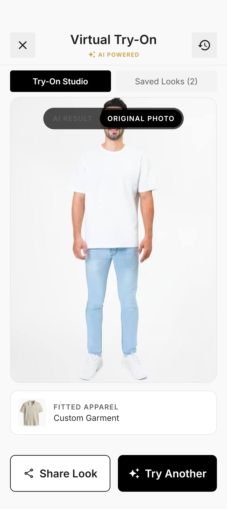 | 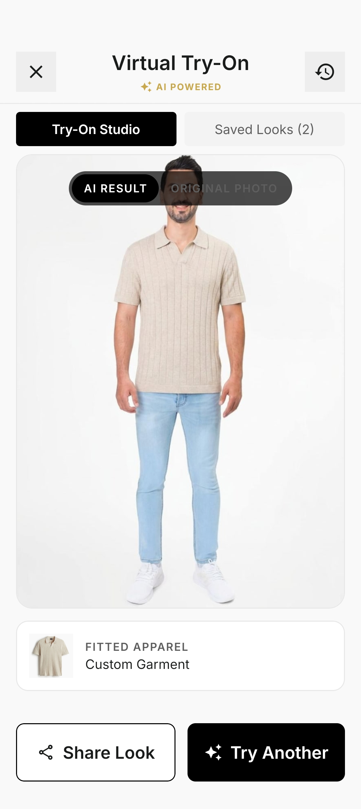 |
| *Reference photo with target garment selection* | *Photorealistic AI try-on visualization* |

---
## Tech Stack

| Layer | Technology |
|---|---|
| **Mobile** | React Native (Expo Router), Zustand, React Query |
| **Backend** | Node.js, Express.js (v5) |
| **Database** | MongoDB Atlas + Atlas Vector Search |
| **AI — Inference** | Google Gemini (`gemini-3.5-flash-lite`) |
| **AI — Embeddings** | Google Gemini (`gemini-embedding-001`, 768-dim) |
| **AI — Agentic orchestration** | Gemini native function-calling API |
| **Image Storage** | Cloudinary |

---

## Core Feature 1 — Agentic RAG Recommendation Engine

This is the centerpiece of the system. Every outfit request — whether triggered by the user, the chatbot, or the daily recommendation — flows through a **5-stage pipeline**.

### Stage 1: Intent Extraction

The user's natural-language query (plus recent conversation history) is parsed by Gemini into a structured intent object. This captures:

- **Occasion, formality, season, weather suitability, style tags**
- **Per-slot constraints** — e.g. "pink top", "black trousers", "no heels"
- **Mood descriptors** — qualitative requests like "dark academia vibe" or "feel powerful"
- **Refinement detection** — whether this message modifies a prior suggestion (slot swap, anchor-and-explore) or starts fresh
- **Exclusion constraints** — items/colors/types explicitly ruled out

All extracted values are validated against a closed enum set — LLM output is never trusted raw. On parse failure, the system degrades to a safe default intent rather than erroring out.

> **Design decision:** Intent extraction is a separate, deterministic step rather than being fused into retrieval. This makes the downstream pipeline debuggable — you can inspect exactly what the system understood before any retrieval happens.

### Stage 2: Agentic Hybrid Retrieval

This is where it departs from a typical RAG pipeline. Instead of a fixed query pattern, the system uses **Gemini's native function-calling loop** to let the model autonomously decide which wardrobe retrieval calls to make.

The model receives a `searchWardrobe` tool declaration (defined via `SchemaType` from `@google/generative-ai`) and a prompt constructed from the parsed intent. It then issues `functionCalls()` — typically one per outfit slot (top, bottom, footwear, optionally outerwear) — with parameters it chooses based on context: exact color, color family, subCategory, semantic queryText, exclusions, and similarity thresholds.

**The agentic loop:**

1. Model emits one or more `searchWardrobe` function calls with self-selected parameters.
2. Each call executes a hybrid search: MongoDB Atlas Vector Search (768-dim cosine similarity on `gemini-embedding-001` embeddings) combined with metadata filters (category, formality, occasion, availability).
3. Results are summarized and fed back to the model as `functionResponse` parts.
4. The model decides whether to issue follow-up calls — e.g. broadening from exact `color` to `colorFamily` if too few items matched, or lowering `minSimilarity` — up to a hard cap of **10 total tool calls** and **3 per category**.
5. After the model stops calling tools (or hits the cap), a floor check ensures required slots (top, bottom, footwear) have candidates. Any missing slot triggers a direct fallback query.

This is architecturally equivalent to a LangChain/LangGraph ReAct agent — model-driven tool selection within a bounded loop — built directly on Gemini's function-calling API without the framework dependency.

**Graceful degradation:** If the agentic loop fails entirely (API error, timeout), the system falls back to a fixed filter retrieval merged with a plain vector search — the request never fails silently.

### Stage 3: Compatibility Scoring & Candidate Generation

Retrieved items are assembled into outfit combinations (Cartesian product across slots, capped at 500 candidates). Each combination is scored on three weighted axes:

| Component | Weight | How it's computed |
|---|---|---|
| **Harmony** | 55% | Pairwise scoring across all items — color pairing (rule-based lookup table with neutral awareness), pattern compatibility matrix, style overlap + acceptable-mix rules, formality alignment, occasion match |
| **Vector similarity** | 25% | Average cosine similarity of items to the user's query (carried from retrieval) |
| **Constraint match** | 20% | How well each item satisfies its slot-level constraints (color, subCategory, pattern) with fuzzy matching for shades and families |

Before combination generation, each slot's item pool is trimmed to the top 8 by a secondary ranking (60% vector similarity + 40% constraint match) to keep the Cartesian product tractable.

### Stage 4: Ranking & Outfit Composition

Scored candidates pass through three post-processing layers before the final selection:

1. **Personalization blend** — Merges algorithm scores with learned user preferences (item-level, pair-level, context-level — see Core Feature 4). The blend weight scales with learning phase (15% → 30% → 40%) as the system accumulates signal.
2. **Novelty penalty** — Down-weights items that appeared in recent recommendations (7-day recency window, time-decayed) or were already shown in the current conversation session.
3. **LLM composition** — The top 20 scored candidates are passed to Gemini, which selects up to N distinct outfits, names them, and generates per-outfit reasoning (why it works, styling tip, vibe). The LLM enforces locked-slot adherence, exclusion constraints, and anchor-and-explore logic for refinement requests. A programmatic deduplication pass (by item-ID set) runs after selection.

### Stage 5: Independent Verification

A separate Gemini call acts as an **independent auditor** — it verifies each composed outfit against the original slot constraints and exclusions by inspecting raw item attributes, explicitly instructed not to trust the composition step's own claims.

- If a violation is found **with** a valid justification (e.g. "no second white skirt exists in the wardrobe"), the outfit passes with the substitution noted transparently.
- If a violation is found **without** justification (unexplained constraint miss), a **single bounded retry** triggers: `recomposeSingleOutfit` selects a replacement from the same candidate pool, then re-verifies. If the retry also fails, the outfit is returned with the violation noted rather than silently dropped.

> **Design decision:** Verification is bounded to exactly one retry per outfit (`MAX_RETRIES_PER_OUTFIT = 1`) to avoid unbounded LLM call chains. Failing open (returning with noted violations) is preferred over failing closed (returning nothing).

---

## Core Feature 2 — Weather-Aware Daily Recommendations

Each day, the system generates a **single curated outfit** for the user — factoring in real-time weather data and day-of-week context.

### How it works

1. **Daily prompt construction** — `buildDailyPrompt` generates a context-rich query based on the current date: weekend days get a "relaxed leisure" vibe, Fridays get "smart casual transition", weekdays get "sharp weekday confidence." Temperature and weather condition (from the device's location) are injected directly into the prompt.
2. **Full pipeline execution** — The daily prompt flows through the exact same 5-stage recommendation engine described above, with `count: 1`. No separate or simplified path — the daily outfit gets the same retrieval, scoring, personalization, and verification treatment as any interactive request.
3. **Weather-reactive refresh** — If weather conditions change significantly during the day, the system can re-generate the recommendation with a specific `reason`:
   - `rain` → prioritizes closed footwear and layering suitable for wet conditions
   - `temp_warm` → pivots to lighter, breathable options
   - `temp_cold` → pivots to cozier, well-layered options
4. **Persistence** — The daily recommendation is stored in `DailyRecommendation` (one per user per date, upserted), including the `weatherAtRecommendation` snapshot so the user can see what conditions drove the suggestion.
5. **Stylist note** — Each daily outfit is accompanied by a generated natural-language note (`buildDailyStylistNote`) anchored to the primary item and the day's vibe.

> **Design decision:** Daily recommendations reuse the full pipeline rather than a shortcut path. This means the personalization layer, novelty penalty, and verification step all apply — the daily outfit isn't a "dumb random pick," it's the system's best single recommendation given everything it knows about the user's wardrobe, preferences, and today's weather.

---

## Core Feature 3 — AI Stylist Chatbot

The chatbot is **not a separate bolt-on** — it's unified with the recommendation engine. The same 5-stage pipeline powers both the outfit screen and the interactive chat.

### Unified architecture

When a user sends a message through the stylist chat:

1. **Intent classification** — `extractIntent` classifies the message into one of three types:
   - `outfit_request` → flows through the full recommendation pipeline
   - `fashion_question` → answered directly by Gemini (style advice, dress codes, fabric care) without hitting the wardrobe
   - `unrelated` → politely declined — the system doesn't pretend to be a general-purpose chatbot
2. **Conversation continuity** — Messages and responses are maintained in `ConversationSession` (capped at 20 messages). `shownItemIds` tracks which items have already been surfaced for novelty penalization across the session.
3. **Intent merging** — `mergeIntent` enables multi-turn flow: a refinement message only overrides the fields that changed, preserving the prior context. The system handles:
   - **Slot swaps** — "swap with black bottom" locks items from the previous outfit and only replaces the specified slot
   - **Anchor-and-explore** — "I want only black top" anchors on that constraint and frees other slots for exploration
   - **Exclusions from history** — asking for "something else in top" automatically excludes the previously shown top

### Daily + Chat integration

The daily recommendation is linked to chat — if a user refines their daily outfit through the stylist ("I want different shoes for today"), the `DailyRecommendation` record is updated in place. The conversation session is shared so the system maintains context across both entry points.

---

## Core Feature 4 — Smart Wardrobe / Personalization Layer

Recommendations improve over time through a **three-layer learning system** that runs entirely on pre-trained embeddings via API — no custom-trained ML model. It incrementally updates using implicit and explicit user feedback.

### Layer 1: Item-Level Preference (`ItemPreference`)

Each clothing item accumulates signal counts from user interactions:

| Signal | Weight |
|---|---|
| Shared | +0.25 |
| Worn | +0.20 |
| Rated | +0.15 (scaled by `rating / 5`) |
| Saved | +0.12 |
| Skipped | −0.05 |
| Rejected | −0.15 |

A computed `score` (0.1–1.0) is derived from these weights. **Raw signal counts** (`signals.worn`, `signals.saved`, `signals.rejected`, etc.) **are stored separately** from the computed score — so scoring weights can be recalibrated later without losing historical interaction data.

### Layer 2: Pair Affinity (`PairPreference`)

Garment-to-garment compatibility learned from feedback:

- **Raw signals:** `wornTogether`, `savedTogether`, `rejectedTogether`, `shownTogether`
- **Computed score:** `affinityScore` (−1.0 to +1.0) = `(positive − negative) / shownTogether`

Pairs use **canonical ordering** (`getCanonicalPairIds` — lexicographic sort of the two ObjectId strings) to avoid storing `(A, B)` and `(B, A)` as separate records.

### Layer 3: Context Profiling (`ContextPreference`)

Per-context frequency distributions keyed by `occasion_formality` (e.g. `office_semi-formal`) tracking color, style, and pattern preferences. These capture contextual taste — someone who always picks dark tones for office wear will see that reflected in future office recommendations.

### How it feeds into recommendations

The personalization score for an outfit is a weighted blend:

| Component | Weight | Source |
|---|---|---|
| Item preference | 45% | Average `ItemPreference.score` across outfit items |
| Pair affinity | 30% | Average affinity score across all item pairs (canonical lookup) |
| Context match | 25% | How well the outfit's colors/styles match the user's context frequency distributions |

### Learning Phase Progression

The system tracks a `learningPhase` (0 → 1 → 2) on the user model, advancing based on total interaction count:

| Phase | Interactions | Personalization weight in final score |
|---|---|---|
| 0 (cold start) | < 10 | 15% |
| 1 (warming) | 10–49 | 30% |
| 2 (learned) | ≥ 50 | 40% |

The remaining weight goes to the algorithm score (compatibility + vector similarity + constraint match). This prevents over-indexing on sparse preference data early on.

### Temporal Decay

Stale preferences decay automatically to prevent outdated signals from dominating:
- Item preferences inactive for 60+ days → 5% decay (applied weekly, capped)
- Pair affinities inactive for 90+ days → 10% decay

### Frontend Transparency

The frontend surfaces **real backend scores** — compatibility, personalization, novelty penalty, learning-phase percentage — rather than decorative UI numbers. What the user sees is what the algorithm actually computed.

---

## Data Models

| Model | Purpose |
|---|---|
| `Cloth` | Wardrobe item — AI-extracted metadata (category, color, pattern, fabric, style, formality, season, occasions, weather suitability, temperature range), 768-dim embedding, wear stats, cost-per-wear |
| `Outfit` | Composed outfit — array of `clothId` refs with roles/positions, scores, styling metadata (name, why it works, tip, vibe) |
| `Recommendation` | Recommendation event — links outfit to query context, full score breakdown (final, compatibility, personalization, novelty, vector similarity, constraint match), verification result, retrieval trail, learning phase at time of generation |
| `RecommendationEvent` | Granular interaction log — event type (shown, worn, saved, rejected, rated, shared, skipped) with positional and contextual metadata |
| `DailyRecommendation` | One per user per date — links to outfit, stores weather snapshot at time of recommendation, stylist message, conversation session |
| `ItemPreference` | Per-item preference — raw signal counts + computed score + confidence + temporal metadata |
| `PairPreference` | Per-pair affinity — raw signal counts + computed affinity score, canonical pair ordering |
| `ContextPreference` | Per-context (occasion × formality) — color/style/pattern frequency distributions |
| `ConversationSession` | Chat state — message history, shown item IDs, last intent for multi-turn continuity |

---

## Project Structure

```
├── backend/
│   ├── src/
│   │   ├── config/              # Gemini, Cloudinary, MongoDB configuration
│   │   ├── controllers/         # Route handlers (auth, wardrobe, outfit, stylist, plan, analytics)
│   │   ├── middleware/          # Auth, error handling, rate limiting
│   │   ├── models/              # Mongoose schemas (9 core models + User, WearLog, OutfitPlan)
│   │   ├── routes/              # Express route definitions
│   │   ├── services/
│   │   │   ├── ai/              # geminiService — metadata extraction, outfit composition, recomposition
│   │   │   │                    # intentService — structured intent parsing + validation
│   │   │   │                    # embeddingService — embedding generation + Atlas Vector Search
│   │   │   │                    # verificationService — independent constraint auditing
│   │   │   ├── learning/        # signalProcessor — feedback ingestion + learning phase progression
│   │   │   │                    # itemPreferenceUpdater, pairPreferenceUpdater, contextPreferenceUpdater
│   │   │   └── recommendation/  # hybridRetrieval — agentic loop + fallback
│   │   │                        # wardrobeSearchTool — tool declaration + execution
│   │   │                        # compatibilityScorer — harmony, constraint, vector scoring + candidate generation
│   │   │                        # rankingService — orchestrates personalization → novelty → composition → verification
│   │   │                        # personalizationService — 3-layer preference blending
│   │   │                        # noveltyService — recency-based de-duplication
│   │   └── utils/               # Canonical pair ordering, intent merging, error classes
│   ├── app.js
│   └── server.js
│
└── frontend/
    ├── app/                     # Expo Router file-based screens
    └── src/                     # Components, hooks, API services, Zustand stores
```

---


## License

MIT
